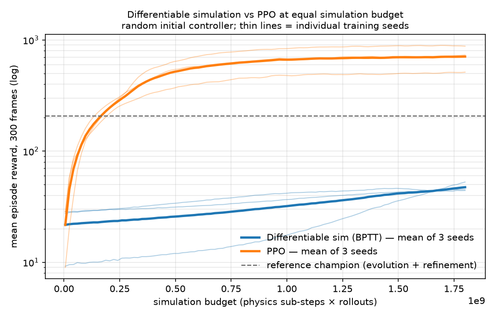

# Experiment log

Running record of hypotheses, settings and outcomes. Newest last.
Negative results are kept — they are the ones that constrain the search.

---

## E0 — Baseline: reward telescoping produces a degenerate policy

2026/06

**Observation.** Champions maximised score without producing sustained swimming:
a single initial impulse followed by passive drift.

**Diagnosis.** The per-step reward is `progres = distance_t − distance_{t−1}`,
accumulated over the episode. The sum telescopes:

```
Σ (d_t − d_{t−1}) = d_final − d_initial
```

The optimised objective is therefore **net displacement**, indifferent to how it is
obtained. Combined with a low drag coefficient (`water_drag = 0.005`), a launched body
drifts for a long time, so one impulse pays as much as sustained swimming at a fraction
of the energy cost. The agent was doing exactly what was asked.

**Secondary issue.** `apply_action` used `0.85 · base − 0.3 · base · action`, so an action
of zero still commanded a 15% contraction — a free initial impulse, since the energy term
`|base · action|` charged nothing for it.

**Conclusion.** Specification problem, not an optimisation problem.

---

## E1 — Fix the neutral point and the energy metric

2026/08/05

**Changes.**
- `new_lengths = base − 0.3 · base · action` (neutral point back at natural length)
- `energy_step = Σ |new_lengths − base|` (deviation from natural length, not command amplitude)

**Result.** Phase 1 champion reaches **240.8** at generation 14 (11 nodes, 16 links:
9 muscles, 7 bones). Replay confirms **actual swimming**: the body deforms continuously
and translates, no longer a single impulse.

**Caveat found while replaying.** `visualize.py` had not been updated with the new
`apply_action`, so the first replay showed a frozen creature. Training and replay code
must be kept in sync — a replay discrepancy looks exactly like a training failure.

**Side effect to keep in mind.** `|new_lengths − base| = 0.3 · base · |action|`, so the new
penalty is exactly 0.3× the previous one. At unchanged `coeff_energie`, energetic pressure
was divided by ~3.3. Before/after comparisons are not on the same scale.

**Open issue.** The within-generation *mean* degrades even as the population maximum rises
(e.g. gen 16: 81.8 → 57.7 → 30.7 → 26.2). `best_score` is a running maximum over ~900
noisy samples and only ever increases, so it is not evidence of learning. The mean is the
honest metric — and it goes the wrong way.

---

## E2 — Phase 2 refinement degrades the policy

2026/08/10
**Setup.** `train2.py`, champion gen 14, `BATCH_SIZE = 600`, `FRAME_NB = 300`,
truncated BPTT every 60 frames, Adam `lr = 1e-3`, exploration noise annealed 0.030 → 0.020.

| episode | mean | mean distance |
|---|---|---|
| 0 | 116.7 | 126.1 |
| 20 | 94.1 | 101.9 |
| 50 | 82.7 | 90.4 |
| 100 | 72.2 | 79.5 |

**Result.** Mean performance drops ~38% over 100 episodes, near-monotonically. `score max`
stays flat around 380–410: the distribution spreads rather than shifts. Exploration noise
*decreases* over the same window, so it cannot explain the loss.

**Conclusion.** Gradient descent is actively degrading the objective it optimises.

---

## E3 — Control: is the optimiser the cause?

2026/08/12
**Setup.** Identical to E2 with `LEARNING_RATE = 0`. Nothing else changed.

| episode | mean | mean distance |
|---|---|---|
| 0 | 117.5 | 127.1 |
| 20 | 116.1 | 125.8 |
| 30 | 120.7 | 130.4 |
| 50 | 115.5 | 125.0 |
| 60 | 125.4 | 135.3 |

**Result.** Mean is stable at 115–125 across 60 episodes. The only difference from E2 is
whether the gradient is applied.

**Conclusion.** **The Adam updates are the cause of the degradation.** This rules out
state accumulation between episodes, simulator instability, and the exploration schedule.

**Bonus observation.** At `lr = 0` the mean drifts slightly upward (117 → 125) as noise
anneals (0.030 → 0.024) — less perturbation, better performance. The annealing schedule
behaves as intended.

---

## E4 — Learning rate sweep: bad step size or bad direction?

**Setup.** Batch 2000, 50 episodes per run, one parameter changed at a time.
Exploration noise annealed identically across all runs (0.030 → 0.025), so it
introduces no bias between them.

| lr | mean @ 0 | mean @ 50 | shape |
|---|---|---|---|
| 0 (control) | 117.5 | 115.5 | flat |
| 1e-5 | 125.8 | 123.4 | flat, indistinguishable from control |
| 5e-5 | 112.7 | 137.6 | slow, still rising at 50 |
| 1e-4 | 116.6 | 142.9 | rises to ~148 by ep 40 |
| 3e-4 | 116.1 | 132.8 | peaks 147 at ep 20, then declines |
| 5e-4 | 113.5 | 110.3 | peaks 141 at ep 10, then collapses |
| 1e-3 | 116.7 | 82.7 | monotone collapse |

**Conclusion.** Classic step-size signature: too large diverges, too small does
nothing, and there is a working band in between. The gradient **direction** is
sound — at 1e-4 it improves performance by ~23% net of the control drift.
`clip_grad_norm_(1.0)` bounds the gradient norm but preserves its direction, so
it offers no protection against an oversized step.

**Secondary finding.** The larger the step, the earlier the peak and the steeper
the subsequent decline. A fixed learning rate cannot be optimal across the whole
run: the policy improves until the step becomes too large relative to local
curvature, then diverges.

---

## E5 — Long runs: the 50-episode ranking is misleading

**Setup.** 150 episodes, batch 2000, lr = 1e-4 vs lr = 5e-5.

| episode | 1e-4 | 5e-5 |
|---|---|---|
| 0 | 114.5 | 116.7 |
| 50 | 150.3 | 135.8 |
| 90 | 147.4 | 151.7 |
| 150 | 147.4 | 157.0 |

**Result.** `lr = 1e-4` plateaus at ~150 from episode 50 onward — the following
100 episodes gain nothing. `lr = 5e-5` rises steadily to 157.0 and is **still
climbing at episode 150** (+34% from start). The curves cross around episode 90.

**Conclusion.** A sweep truncated at 50 episodes would have selected the wrong
setting. Short-horizon comparisons are unreliable here.

**Caveat.** Two separate runs at lr = 1e-4 (E4 and E5) start at 116.6 and 114.5
and follow visibly different trajectories (145.6 vs 139.5 at episode 20). Run-to-
run variance is real and single runs should not be over-interpreted.

---

## E6 — The saved champion is not the champion that scored

**Symptom.** Champions were not reproducible: `champion_gen_9` was saved with a
score of 139.2, but replaying it under identical training conditions (batch 30,
200 frames, 600 samples) never exceeded 92, with a mean of 62.

**Hypotheses tested and eliminated.**
- Extreme-value statistics alone — ruled out: 600 replay samples should have
  recovered 139 if it were reachable.
- Exploration noise missing at replay — ruled out: adding it changed nothing.
- Stale weights inherited across a topology mutation — ruled out: the log shows
  the record was set *during* generation 9.

**Cause.** Champion weights were extracted from `params` **after**
`optimizer.step()`, while the score had been obtained with the pre-update
weights. At `lr = 1e-3` a single gradient step was enough to destroy a good
policy, so every archived champion was a degraded version of itself.

**Fix.** Move champion selection and weight extraction before `optimizer.step()`.

**Verification.** A champion saved after the fix scores **157.9** in training and
**156.8** on replay — a 0.7% gap, against 34% before.

---

## E7 — Phase 1 control: does the gradient contribute anything?

**Date:** 2026/09/06

**Setup.** `train.py`, 18 generations, POP_SIZE = 50, BATCH_SIZE = 30, `SEED = 0`.
Curriculum removed since E6 (`coef_energie = 10000`, `coef_hauteur = 0` throughout):
energy refinement now belongs to phase 2, and a mid-run objective switch made
scores incomparable across generations. Two runs, `lr = 1e-4` and `lr = 0`,
identical in every other respect.

**Seeding validates the pairing.** Both runs report 22.30 max / 0.28 mean at
generation 0, episode 0 — identical to the decimal, as expected before any
gradient step is applied. The curves separate from episode 5 onward. `lr` is the
only variable.

| generation | lr = 1e-4 | lr = 0 |
|---|---|---|
| 0 | 0.68 | 0.28 |
| 3 | 9.20 | 9.05 |
| 6 | 19.63 | 17.15 |
| 9 | 26.93 | 12.46 |
| 12 | 34.06 | 15.40 |
| 14 | 33.61 | 15.24 |
| 15 | 35.60 | 15.36 |

**Result.** The gradient run reaches **+121%** over control at generation 14 and
stabilises around 36. The control plateaus near 15 from generation 8 and
**regresses** between generations 6 and 9 (17.15 → 12.46).

**Conclusion.** Contrary to what the intra/inter-generation decomposition
suggested, phase 1 gradient learning carries most of the gain. The mechanism is
indirect: at `lr = 0` all 30 brains of a creature stay strictly identical (they
are loaded from the same `creature.brain_weights` and nothing perturbs them), so
end-of-generation selection has no diversity to select from. The gradient
*produces* the variation; selection only *banks* it at the generation boundary.
This is why the gain appears as jumps between generations while within-generation
progress looks small — the two are not separable.

**Secondary finding.** Under `lr = 0`, morphological mutation alone *degrades*
performance across generations 6–9. Topology search without a controller able to
adapt to the new topology is not merely useless, it is harmful. Direct argument
for co-optimisation rather than staged search.

**Side note.** Removing the curriculum leaves no visible discontinuity:
generations 14 → 15 → 16 read 33.61 → 35.60 → 36.14. The former switch at
generation 15 is confirmed to have been inert (E6 measured −1.2% for a ×33 change
in energy pressure).

**Caveat.** Single run per setting. E5 established that run-to-run variance is
real; a ×2.2 gap is far outside plausible noise, but the exact plateau values are
not to be over-interpreted.

---

## E8 — Selection on a single rollout optimises luck, not skill

**Symptom.** Even after E6, replayed champions varied wildly with the initial
condition: the same policy and seed range produced 206, 97 and 24 units of
displacement across three replay configurations.

**Cause.** Each morphology carried 30 brains that diverged under their own
gradients, and `argmax` picked the best *single* rollout. Since each variant also
faced a different initial perturbation, the selection rewarded a favourable
starting state as much as a better policy.

**Fix.** One brain per morphology, evaluated on 30 concurrent rollouts. The loss
being a sum, each brain receives the **mean gradient** of its rollouts, so the
optimised quantity is expected performance rather than a best case. Selection by
`argmax` is removed entirely; the generation's final weights are inherited.

**Result.** Champion 222.8 at generation 28. Champion-to-population-mean ratio
drops from 4:1 to 1.8:1. Replay gives a mean of 163 over 20×30 samples with a
spread of 157–172 — stable.

---

## E9 — Gradients explode through the stiff simulator

**Symptom.** After E7 the phase-2 mean stagnated (124 → 116 → 121 → 122 over 30
episodes) regardless of learning rate.

**Measurement.** Logging the pre-clip gradient norm gave **1.3 × 10⁸** with BPTT
truncation every 60 frames (600 compounded physics steps). `clip_grad_norm_(1.0)`
was dividing by a hundred million and preserving only a direction dominated by
whichever components had blown up.

**Fix.** Truncate every 10 frames instead of 60, raise `max_norm` to 10.

| truncation window | gradient norm |
|---|---|
| 60 frames | 1.3 × 10⁸ |
| 10 frames | ~870 |

**Result.** Phase 2 on champion gen 28, 250 episodes, lr = 5e-5, batch 500:
**124.8 → 222.0**, +78%, near-monotonic. Relative spread improves from 22% to
16% of the mean. The gradient norm itself settles to 17–200 as the policy
improves — a better policy produces better-conditioned dynamics.

Peaks of 400–1400 persist and are absorbed by the clip. This residual
ill-conditioning is the concrete argument for the short-horizon-plus-critic
approach of Xu et al.

**Behavioural outcome.** The refined champion travels 615 units over 1000 frames
(911 on the best seed), against 63 for the broken champion of E6, and no longer
locks onto a fixed point within its 300-frame training horizon. Beyond 300 frames
the behaviour degrades — expected, since that is the edge of the training
distribution.

## E10 — A policy can travel twice as far and still be unusable

**Date:** 2026/09/20

**Setup.** Two candidates compared as the repository's reference champion, both
replayed with `evaluate_seeds.py`, 20 seeds × 1000 frames, identical conditions.

| checkpoint | topology | mean displacement | range |
|---|---|---|---|
| `raffine_ep250` | 9 nodes, 12 links | 577 | 156 – 791 |
| `raffine_ep100` | 11 nodes, 16 links | 1064 | 82 – 1538 |

**Result 1 — the wider spread is bimodal, not noisy.** `ep100` produces either
~1300–1540 (13 seeds) or ~80–730 (7 seeds), with nothing in between. On the
failing seeds the action vector freezes at constant values from roughly frame 100
onward: the policy settles into a fixed point and stops swimming. `ep250` is
unimodal over the same range of initial conditions.

**Result 2 — the archived score is not the score that was earned.** Replaying
`ep100` under exact phase-1 conditions (`verify_reproducibility.py`, 20 × 30
samples) gives a best of **282.96** and a mean of **172**, against an announced
**427.9** — a 34% gap, the same signature as E6.

**Cause.** E6 was fixed in `train.py` but not in `train2.py`, where
`meilleurs_poids` was still extracted from `cerveau.state_dict()` *after*
`optimizer.step()`. Every phase-2 checkpoint produced before this date is
therefore one gradient step past the policy that earned its filename.

**Fix.** Move the champion capture before `optimizer.step()` in `train2.py`, as
was done in `train.py` after E6.

**Caveat.** One gradient step at `lr = 5e-5` does not plausibly account for a
factor of 1.5. The announced 427.9 most likely also comes from a run on a
different reward scale — E1 documents a ×3.3 change in the energy penalty between
versions. The number is not comparable to anything measured since, and is not
used anywhere in the repository.

**Conclusion.** Mean displacement alone is not a selection criterion. `ep100` goes
further on average and produces the most convincing gait visually, but it is
bimodal and its provenance is broken; `ep250` is slower and reproducible. The
repository ships `ep250` as `champion_raffine/reference.pt` and uses `ep100` only
as the README demonstration GIF, labelled as such.

## E11 — Baseline: differentiable simulation vs PPO at equal budget

**Date:** 2026/09/29 – 2026/10/02 — **Status:** complete, 3 training seeds per method.

> ⚠️ **Superseded by E12.** All runs here use `sub_step = 10`, which E12 shows to be
> numerically unstable: the controllers, PPO's in particular, exploit integrator
> artefacts. The comparison holds *within that simulator*; the displacements have no
> physical meaning. E11 is kept unchanged as a record.

**Question.** Does the gradient through the simulator buy anything over a
standard model-free method, and at what budget does the advantage flip?

**Setup.** Morphology frozen to `champion_raffine/reference.pt`; both methods
start from a random brain (`--poids-aleatoires`). Same physics, reward, horizon
(`train2_frame_nb = 300`) and 2000 rollouts per iteration, so one PPO iteration
costs exactly one `train2.py` episode in physics sub-steps (`sim_steps`).
PPO: CleanRL-style, actor = `Brain`, separate 64-64 critic, GAE (γ = 0.99,
λ = 0.95), clip 0.2, 10 epochs × 8 minibatches, lr 3e-4, state-independent
log-std initialised at 0.2, log-likelihood restricted to real muscles.
3 training seeds per method.

**Environment check** (`baselines/check_env.py`, 200 rollouts × 300 frames, CPU).
The `train2.py` loop and `SwimEnv` produce **bit-identical trajectories**
(max |Δ displacement| = 0). Episode rewards differ by 2.26 out of 208.75 (1.1%),
entirely explained by `SwimEnv` crediting each action with the motion it causes,
which adds the last 5 frames of progress; residual after correction 3·10⁻⁵.
The check also runs in CI (`tests/test_env.py`).

**GPU runs are not bit-reproducible.** The same check on a Colab GPU (2000
rollouts) failed: max |Δ displacement| = 125 on some rollouts, with means
agreeing to 0.1%. Control: the `train2.py` loop against *itself*, same seed, on
GPU — max |Δ| = 96, means 208.60 vs 208.71. The divergence is therefore not in
`SwimEnv`: CUDA `scatter_add_` sums in a non-deterministic order, and the stiff,
chaotic dynamics amplify ~1e-7 rounding differences over 3000 sub-steps. On CPU
both loops stay bit-identical (re-checked on Colab CPU: Δ = 0). Consequences:
`check_env.py` now always runs on CPU, and GPU runs are compared as
distributions over training seeds, never as single trajectories.

**Smoke test** (50 envs, 100 frames, 20 iterations, CPU): PPO from a random
brain goes from 15.5 to 49.6 evaluation reward, KL ≈ 0.013 per update. The
pipeline learns; this is not a result.

| method | score @ equal budget | evaluate_seeds mean displacement (20 × 1000 frames) | range |
|---|---|---|---|
| diffsim (BPTT), seed 0 | 46.5 | 106 | 44 – 148 |
| diffsim (BPTT), seed 1 | 52.8 | 127 | 41 – 178 |
| diffsim (BPTT), seed 2 | 45.6 | 87 | 23 – 132 |
| PPO, seed 0 | 734.0 | 2451 | 2206 – 2750 |
| PPO, seed 1 | 894.5 | 3255 | 2933 – 3406 |
| PPO, seed 2 | 514.1 | 1646 | 1378 – 1903 |
| **diffsim, mean ± std** | **48.3 ± 3.9** | **107 ± 20** | |
| **PPO, mean ± std** | **714 ± 191** | **2451 ± 805** | |
| reference champion (E10) | — | 577 | 156 – 791 |

Score = best mean training reward over 300 iterations (diffsim: training episode, PPO: deterministic evaluation), 300 frames, budget 1.8·10⁹ physics sub-steps × rollouts for both; std = sample std over the 3 training seeds. Displacement = `evaluate_seeds.py`, 20 initial conditions × 1000 frames. Logs in `results/E11/runs/`, evaluation output in `results/E11/eval.txt`.

**Figure.** `docs/baseline_ppo.png`



**Observations.**
- At equal simulation budget PPO is ~15× better on the training reward and ~23× on
  1000-frame displacement. Its *worst* seed travels 2.9× further than the reference
  champion obtained by evolution + refinement.
- PPO is also far more robust across initial conditions (±11–16% of the mean over 20
  seeds, against ±50–55% for diffsim).
- PPO generalises beyond its 300-frame training horizon (≈2.45 units/frame on both 300
  and 1000 frames). The degradation beyond 300 frames reported for the reference champion
  is therefore not a property of the reward alone.
- Video check (`visualize.py`, PPO seed 0): regular undulatory gait, no visible
  exploit of the reward.
- diffsim learns, but slowly and almost linearly, and its 3 seeds end within 45.6–52.8
  whatever their start (27, 9, 28); seed 1 starts near 9 and only
  accelerates after ~150 episodes, still rising at episode 300. Seed 0 peaks at
  episode ~245 then degrades (std 6.5 → 11) once exploration noise hits its floor.
- Wall-clock: one diffsim episode ≈ 15 s vs one PPO iteration ≈ 6 s on a T4 —
  diffsim also costs ~2.5× more compute per simulation step (backward through physics).

**Same seed, two GPU runs.** PPO seed 2 was accidentally run twice: best evaluation
525.1 vs 514.1 (2%). The checkpoint kept is the second run's (both wrote the same file);
the first log is archived in `results/E11/gpu_nondeterminism/`. A first PPO seed-1 run
reached 863.8 but its outputs were lost (Colab Drive writes not flushed before the
runtime ended); the rerun reached 894.5 (3.5% apart). Both pairs show that same-seed
GPU runs differ by a few percent — small against the ×15 gap between methods, and the
reason methods are compared across seeds, never on single runs.

**Candidate causes of the gap (to test in E12).**
1. Step size: 1 Adam update per episode at lr = 5e-5 (tuned in E4/E5 for refining an
   already-good controller), vs 80 updates at 3e-4 for PPO.
2. Gradient myopia: BPTT truncated every 10 frames (2 decisions), no value of the
   state beyond the window; PPO credits actions over the full episode via its critic.
3. Ill-conditioned analytic gradients through stiff, chaotic dynamics (E9; Suh et al.,
   ICML 2022).
4. Exploration: noise 0.03 → 0.005 vs policy std 0.2.

**Both outcomes are informative.**
- Differentiable simulation reaches a given score with less simulation:
  sample-efficiency advantage of the analytic gradient.
- PPO catches up or overtakes: consistent with the gradient ill-conditioning
  measured in E9, and with the short-horizon + critic approach of Xu et al.

**Conclusion.** At equal simulation budget, PPO outperforms gradient-based learning
through the simulator by ×15 in training reward (714 ± 191 vs 48 ± 4) and ×23 in
1000-frame displacement, learns faster, and is more robust across initial conditions;
it surpasses the reference champion — itself the product of morphology evolution plus
refinement — after ~25 iterations. In its current form, train2 is not competitive for
learning a controller from scratch. Caveat: its learning rate was tuned in E4/E5 for
refining an already-good controller, not for learning from a random one. Next steps
(E12): (1) one optimiser update per truncation window (every 10 frames) instead of one
per episode, then a learning-rate sweep; (2) a learned critic V(s) bootstrapping the
return beyond each window (SHAC, Xu et al. 2022), so the gradient horizon stays short
where analytic gradients are well-conditioned while the policy still optimises
long-term return.

---

## E12 — The learned gaits exploit an integrator instability

**Date:** 2026/10/03

**Symptom.** In video, the PPO controller of E11 (seed 1, 3255 units / 1000 frames)
moves forward with jerky, chattering muscle commands rather than an undulation.

**Gait diagnosis** (`tools/diagnose_gait.py`, 20 rollouts × 300 frames, `sub_step = 10`).

| | PPO seed 1 | reference | diffsim seed 1 |
|---|---|---|---|
| mean \|a\| | 0.41 | 0.72 | 0.25 |
| mean \|Δa\| between decisions | **0.69** | 0.17 | 0.04 |
| nodes at the ±20 velocity clip | **8.1%** | 3.9% | 4.4% |
| vertical drift (units) | **73** | 0.7 | 0.2 |
| energy penalty / progress | 0.08% | 0.5% | 0.7% |

PPO's mean command jump exceeds its mean amplitude: commands flip sign at almost every
decision. The energy penalty is negligible for every method, so nothing in the reward
discourages chattering.

**Transfer to finer integration** (`evaluate_seeds.py --sub-step`, 20 seeds × 1000
frames; `dt = 1/sub_step`, the physical time per frame is unchanged).

| controller | sub_step 10 | 20 | 40 |
|---|---|---|---|
| PPO seed 1 | 3255 | 17 | 17 |
| reference | 577 | 36 | 36 |

Both collapse, and 20 ≈ 40.

**Open-loop convergence test** (`tools/convergence_test.py`, reference morphology,
fixed commands, no learned controller, 8 rollouts × 300 frames).

| command | sub_step 5 | 10 | 20 | 40 | 80 |
|---|---|---|---|---|---|
| rest (a = 0) | 3.1 | **23.4** | 0.0 | 0.0 | 0.0 |
| slow travelling wave | 3.7 | 54.7 | 26.4 | 28.3 | 26.4 |
| bang-bang, sign flip each decision | 5.1 | **228.8** | 30.5 | 32.1 | 22.8 |

At `sub_step = 10` a creature **at rest** drifts 23 units with velocities hitting the
±20 clip; from 20 upward it stays exactly still. A fixed wave converges to ≈ 27 from 20
upward. A bang-bang command gets ×7–10 more displacement at 10 than in converged
physics: that is the mechanism PPO found, and probably part of what evolution found
for the reference.

**Hypothesis for the mechanism (not yet verified).** Damping is explicit with
`c = 2√k` per link (≈ 4.5 for a bone); a node attached to 2–3 links sees an effective
`c·dt ≈ 1` at `dt = 0.1` — the stability limit of explicit damping, beyond which
relative velocities overshoot and flip sign each sub-step instead of decaying.
Combined with the asymmetric drag, the resulting numerical oscillation produces
thrust. At `dt = 0.05`, `c·dt ≈ 0.5`.

**Conclusion.** `sub_step = 10` is numerically unstable; every displacement reported
in E0–E11 was obtained in that regime and is partly a numerical artefact, which
learned controllers exploit — the more exploratory the method, the more so. The
engine itself is sound: physics converges from `sub_step = 20`, and a naive open-loop
wave already swims (≈ 27 units / 300 frames). Changes: `sub_step = 20` by default;
the reference and E11 checkpoints are kept as records of the unstable regime. Next:
retrain PPO and diffsim at `sub_step = 20` — a learned controller must beat the
open-loop wave — and revisit the ±20 velocity clip, still active for violent
commands at every resolution.

---

## E13 — Planned: per-window updates and full truncation (at `sub_step = 20`)

Code in `train2.py` (opt-in): `--detachement-complet` and `--maj-par-fenetre`.
The historical truncation detaches only `X, Y, vX, vY`: gradients still leak across
window boundaries through observation → action and through `previous_distance`, so
the "10-frame truncation" of E9–E11 was partial. Protocol: historical vs full
truncation (1 update / episode) vs per-window updates (30 / episode), one variable at
a time, in converged physics.

---

## E14 — PPO in converged physics (`sub_step = 20`)

**Date:** 2026/10/03 — **Status:** 1 training seed. Conclusion: this gait exploits the ±20
velocity clip.

**Setup.** As E11 (reference morphology, random initial controller, 2000 rollouts,
300 frames), at `sub_step = 20`, 200 iterations, physics compiled
(`--physique-compilee`, `MegaCreaFast` + `torch.compile`: ~13 min on a T4 instead of
~45). Checkpoint in `results/E14/`.

**Learning curve.** Evaluation reward 4.5 → 496 over 200 iterations, still rising.
Compared with E11 seed 0 at `sub_step = 10` (28 → 734), learning stalls near 30–60
for ~40 iterations before taking off: the numerical thrust of E12 was easy to find,
real propulsion is not.

**Convergence check** (`evaluate_seeds.py`, 10 seeds × 1000 frames).

| sub_step | 20 | 40 | 80 |
|---|---|---|---|
| mean displacement | 1508 | 1535 | 1512 |

Stable within 2%: unlike every controller of E0–E11, this gait is a property of the
physics, not of the integrator. ≈ 19× the open-loop wave of E12 (≈ 27 / 300 frames),
same speed over 300 and 1000 frames, vertical drift 3.7 (73 in E11).

**Gait** (`tools/diagnose_gait.py`, `sub_step = 20`).

| | PPO, E11 (unstable) | PPO, E14 |
|---|---|---|
| mean \|Δa\| between decisions | 0.69 | 0.53 |
| mean \|a\| | 0.41 | 0.47 |
| saturated commands (\|a\| > 0.95) | 0.7% | 12% |
| nodes at the ±20 velocity clip | 8.1% | 4.9% |
| energy penalty / progress | 0.08% | 0.15% |

Real but still chattering: commands still flip at almost every decision, and the
energy penalty is negligible, so nothing in the reward discourages it.

**Velocity-clip test.** `apply_physics` clamps every node velocity to ±20 — a
safeguard from the unstable-integrator era, with no physical meaning. Same controller,
no retraining, clip varied (`evaluate_seeds.py --v-max`, 10 seeds × 1000 frames,
`sub_step = 20`):

| v_max | 20 | 40 | ∞ |
|---|---|---|---|
| PPO mean displacement | 1508 | 81 | 81 |

Open-loop control (`tools/convergence_test.py --v-max inf`, 8 rollouts × 300 frames):
no rollout diverges for any command or step size — the physics does **not** need the
clip to stay stable. But the clip itself produces thrust: the bang-bang command
travels ≈ 23–32 with the clip, ≈ 11–18 without it (peak node speed 38–45). A clamped
node discards part of the impulse it receives, so a link no longer pushes its two
ends symmetrically: momentum is not conserved, and the asymmetry becomes net motion.

**Conclusion.** The E14 gait is integrator-independent but rides on the velocity
clip: removing it divides displacement by ~18. Part of the drop is distribution shift
(velocities > 20 never seen in training), but the open-loop control shows the clip
alone roughly doubles bang-bang thrust. Second simulator artefact found by RL after
E12 — the more an optimiser explores, the more it finds what the simulator gets
wrong. Changes: `v_max = ∞` by default (configurable everywhere; use `--v-max 20
--sub-step 10` to replay checkpoints from E0–E11). Side confirmation of E12: with the
clip removed, `sub_step = 10` diverges to NaN within 50 frames (`tests/test_env.py`
had to move to `sub_step = 20`) — the clip had been hiding the instability. Next: retrain PPO without the clip
and rerun the same checks (step-size convergence, gait diagnosis, video) until no
artefact is left; then smoothness (E15).

---

## E15 — PPO without the velocity clip: first artefact-free controller

**Date:** 2026/10/03 — **Status:** 1 training seed.

**Setup.** As E14 (`sub_step = 20`, 200 iterations, compiled physics) with the ±20
velocity clip removed (`v_max = ∞`, new default). Checkpoint in `results/E15/`.

**Learning curve.** Evaluation reward 4.5 → 211, flattening near 200–210 (E14 with
the clip: 496). The first ~30 iterations are identical to E14 to the printed digit —
same seed, and no node reaches 20 while the creature barely moves — and the two runs
separate around iteration 40–50, exactly when the clip starts to bind. A built-in
control for the E14 diagnosis.

**Convergence check** (`evaluate_seeds.py`, 10 seeds × 1000 frames, no clip).

| sub_step | 20 | 40 | 80 |
|---|---|---|---|
| mean displacement | 619 | 623 | 612 |

Integrator-independent (2%), with no clip to lean on: the first controller of the
project that survives both artefact tests. ≈ 8× the open-loop wave of E12.

**Gait** (`tools/diagnose_gait.py`, `sub_step = 20`, 20 rollouts × 300 frames).

| | E11 (unstable) | E14 (clip) | E15 |
|---|---|---|---|
| mean \|Δa\| between decisions | 0.69 | 0.53 | 0.42 |
| mean \|a\| | 0.41 | 0.47 | 0.46 |
| saturated commands | 0.7% | 12% | 7.6% |
| nodes at \|v\| ≥ 20 | 8.1% | 4.9% | 1.9% |
| vertical drift | 73 | 3.7 | −22 |
| energy penalty / progress | 0.08% | 0.15% | 0.25% |

Each artefact removed made the gait less chattering, but it is still visibly jerky in
video: commands still flip at nearly every decision.

**Caveats.** (1) ⚠️ The gait table above was measured by `diagnose_gait.py` with its
`--v-max` defaulting to 20, i.e. *with* the clip this controller was trained without.
That explains its 291 mean displacement against 211 for PPO's own evaluation and 214
in `visualize.py`; the default is now ∞ and the E15 row must be re-measured (see E16).
(2) A first
diagnosis run defaulted to `sub_step = 10` (tool default, since fixed to 20) and is
discarded; the E14 no-clip diagnosis that returned NaN had the same cause.

**Why the reward does not discourage chattering.** The energy term is
Σ |new_length − rest_length|: it charges *amplitude*, not *change*. A muscle
alternating ±0.4 every decision pays the same as one held at 0.4. Raising
`coef_energie` would shrink contractions without smoothing them.

**Next (E16).** Smoothness penalty λ·Σ(a_t − a_{t−1})² on real muscles
(`--coef-regularite`, off by default, same term for PPO and train2), PPO at
λ ∈ {0.1, 1}; compare displacement (not reward, which now includes the penalty),
|Δa| and video.

---

## E16 — Smoothness penalty: speed vs chattering

**Date:** 2026/10/03 — **Status:** complete, 1 training seed per λ. **Chosen: λ = 1, 400 iterations.**

**Setup.** As E15 (clean physics: `sub_step = 20`, no clip) plus
λ·Σ(a_t − a_{t−1})² on real muscles (`--coef-regularite`), PPO seed 0, 200 iterations
unless stated. Gait measured with `tools/diagnose_gait.py --n 100` (v_max default fixed to ∞).

| λ | iterations | displacement, 300 frames | mean \|Δa\| | mean \|a\| | saturated commands | nodes at \|v\| ≥ 20 |
|---|---|---|---|---|---|---|
| 0 (E15, re-measured) | 200 | 211 | 0.44 | 0.47 | 8.4% | 3.9% |
| 0.1 | 200 | 197 | 0.39 | 0.43 | 4.9% | 2.9% |
| 0.3 | 200 | 173 | 0.32 | — | — | — |
| 1 | 200 | 96 | **0.09** | 0.27 | 0.0% | 0.0% |
| **1** | **400** | **132** | 0.13 | — | — | — |

The re-measured E15 row now agrees with PPO's own evaluation (211); its previous
diagnosis (291) was run with the velocity clip on.

**Reading.** Speed and smoothness trade off monotonically. λ = 0.1 costs 7% speed for a
12% drop in chattering — not worth it. λ = 1 cuts chattering by 5× (smooth commands,
never saturated); doubling its training (200 → 400 iterations) recovers +38% displacement
(96 → 132) for a modest rise in |Δa| (0.09 → 0.13), so most of the λ = 1 gap at 200
iterations was under-training. λ = 0.3 was only trained 200 iterations and is not
directly comparable to the 400-iteration λ = 1 run. The policy std also shrinks faster
under the penalty (0.118 vs 0.150 at λ = 1): the penalty also charges exploration noise.

**Reproducibility note.** With `MegaCreaFast` (incidence-matrix einsums instead of
`scatter_add_` atomics) GPU reruns are bit-identical, which made one apparent result
(λ = 1 long identical to λ = 1 short) traceable to a mislabelled download rather than to
the training.

**Lost run.** The first λ = 1 long run was written to the Colab VM's local disk because
Drive was not mounted; from E17 on, the Colab training cells `assert os.path.ismount("/content/drive")`
before training and call `drive.flush_and_unmount()` after.

**Open hypothesis after E16.** Even the chosen controller is slow (≈ 0.66 body lengths
in 300 frames). Two candidate causes: the reference morphology (selected by evolution in
the artefact-ridden physics of E12/E14, with a weak learner) or the physics itself
(water drag 0.005 too low). Tested in E17.

---

## E17 — Control morphology: an eel in the same physics

**Date:** 2026/10/04 — **Status:** complete, open-loop sweep + 1 PPO seed.

**Question.** Is the slow swimming due to the reference morphology or to the physics?
A control body whose swimming strategy is known from real fish (anguilliform: a wave
travelling head → tail) is built from the same parts (nodes, bones, muscles) and run in
the same `SwimEnv`.

**Body** (`tools/eel_control.py`, saved as `champion_raffine/anguille.pt`, Brain-compatible).
A ladder of 8 vertebrae, length 210 (reference: 200), thickness 10: bone rungs and bone
diagonals, active muscles on the top and bottom edges in antagonism. 16 nodes, 29 links,
so it fits the same `max_noeuds = 20` / `max_muscles = 30` padding and runs through
`baselines/ppo.py` unchanged.

**1. Open-loop wave** (haut_k = A·sin(2πt/T + kφ), bas_k = −haut_k; 120 waves swept over
amplitude, period and wavelength, both directions; 300 frames, `sub_step = 20`).

| water_drag | best eel wave | reference + PPO λ=1 (trained at 0.005) |
|---|---|---|
| 0.005 | 13.9 (0.07 LC) | 136 (0.68 LC) |
| 0.02 | 21.6 (0.10 LC) | 37 (0.18 LC) |
| 0.05 | 25.7 (0.12 LC) | 19 (0.09 LC) |

(LC = body lengths. The reference controller is replayed off-policy at higher drag:
indicative only.) The rest command gives exactly 0 at every drag.

The open-loop result is **not** a valid measure of the eel. The best waves use the
maximum amplitude A = 1.0, at which each segment is commanded to bend ≈ 2 rad: the GIF
(`docs/eel.gif`) shows the body folding onto itself (length 210 → ≈ 100), and reversing
the wave does not reverse the motion (−6 instead of −14). At reasonable amplitudes
(A = 0.2–0.4) the body does form a clean travelling wave of ≈ 10–15 units amplitude but
moves only 10–15 units, with an inconsistent direction. Raising drag suppresses bending
(lateral amplitude ÷5 at 0.05, near zero at 0.5): with muscle stiffness 1 against bone
stiffness 5, the muscles cannot bend a slender body against water that grips it.

**2. PPO on the eel** (λ = 1, 400 iterations, seed 0, random init, drag 0.005; same
command as E16 λ = 1 long). Evaluation reward still slowly rising at the end (29.0).

| | displacement, 300 frames | LC | mean \|Δa\| | vertical drift |
|---|---|---|---|---|
| eel, best open-loop wave | ≈ 14 | 0.07 | — | — |
| **eel + PPO λ = 1** | **39** | **0.19** | 0.08 | 17 |
| reference + PPO λ = 1 (E16) | 132 | 0.66 | 0.13 | — |

**Reading.**
1. My open-loop wave was sub-optimal: PPO finds a gait ≈ 2.8× faster on the same body.
2. But a learned eel is still ≈ 3.4× slower per body length than the reference.
3. This is not a badly built eel: the simulator's building blocks cannot express
   anguilliform swimming.
   - **No skin.** Water acts only on links, and muscles feel 0.3× the drag of bones, so a
     body whose outline is made of muscles is nearly transparent to the water. (Setting
     muscle drag to 1 in the numpy re-implementation did not fix it.)
   - **Weak muscles.** A muscle is a stiffness-1 spring (bones: 5) whose rest length moves
     by at most ±30%: in light water (0.005) a slender body bends but finds no grip; in
     heavy water it grips but can no longer bend.
   - **No reactive forces.** Drag is linear and purely resistive. Real fish get most of
     their thrust from accelerating water backwards (added mass), which is absent here.
   - **No real joints.** Links connect only at nodes: a muscle cannot insert in the middle
     of a rigid bone without splitting it into two bones, which creates a free hinge
     unless it is braced by extra links (within the 20-node / 30-link budget). Lever-arm
     joints as in vertebrates are not representable.
4. Recreating real animals is therefore not a meaningful target for this simulator, and
   the creatures should be read as adapted to their simulated world (as in Sims, 1994),
   not as models of real swimmers.
5. The eel's vertical drift (17 for 39 forward) is large: part of its displacement may be
   a diagonal drift rather than swimming (see Open questions).

**Caveats.** One PPO seed, curve not fully flat at 400 iterations; one eel design
(variants with thickness 6–20, passive or bone diagonals and 8 or 12 vertebrae gave the
same open-loop picture, in a numpy re-implementation of the physics checked against
the PPO checkpoints: 134.7 vs 132.4 and 207 vs 211).

**What E17 does NOT establish.**
- *Whether the reference morphology is good.* The eel was meant as a positive control
  (a body known to swim well); since this physics cannot express its strategy, beating it
  says nothing about how the reference compares with the bodies the simulator *can*
  build. The morphology question must be answered with morphologies from the same
  generator (`train.py`'s `generer_topologie` / `elite_mutant/`) trained with the same
  PPO λ = 1 protocol.
- *Whether more drag would help.* The open-loop eel numbers at higher drag come from the
  folding artefact, and the reference controller was replayed off-policy (trained at
  0.005). A valid test retrains PPO at each drag. Not run: changing drag changes the
  physics, and the physics is frozen for now.

**Decision.** The physics stays as is (`sub_step = 20`, no clip, water_drag = 0.005).
Next: the method comparison (train2 vs PPO, 3 seeds) in this physics with the final
reward (λ = 1); the in-family morphology test is optional.

---

## Open questions

- Is the vertical drift observed in replay (the body sinks as it advances) contributing to
  the displacement reward? If the motion is partly a diagonal fall, distance overstates
  swimming performance.
- `coef_hauteur` is currently 0. Undulatory swimming necessarily moves the barycentre
  vertically, so a height penalty may punish the target behaviour — worth testing a
  progressive schedule before reintroducing it.
- Adam is re-instantiated at every generation in `train.py`, so its moment estimates reset
  roughly every 20 episodes. Unavoidable in part (parameter shapes change under mutation),
  but it means phase 1 never runs a warm optimiser.
- The reward still telescopes to net displacement, so nothing requires sustained
  motion. Next experiment: reward maintained velocity instead.

## Related work to read

- Xu et al., *Accelerated Policy Learning with Parallel Differentiable Simulation* —
  documents exactly the E2/E3 symptom: gradients through stiff differentiable simulators
  are high-variance and biased over long horizons. Proposes short-horizon rollouts with a
  learned critic for the tail.
- Ma et al., *DiffAqua: A Differentiable Computational Design Pipeline for Soft Underwater
  Swimmers* (SIGGRAPH 2021) — the closest published analogue to this project.
