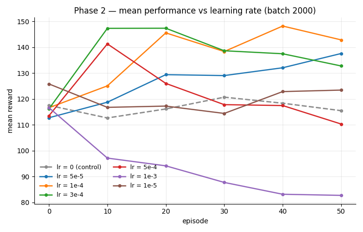
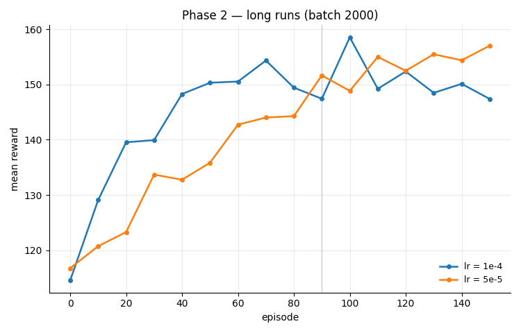

# 🧬 Massively Parallel Neuroevolution for Aquatic Soft-Body Locomotion

## 🚀 Overview

This repository implements a custom, fully vectorized 2D physics engine built from scratch in PyTorch to simulate soft-body aquatic creatures.

Instead of relying on standard loops or pre-built engines, this project leverages `torch.func.vmap` to achieve **massively parallel neural network evaluations**. By vectorizing both the physics simulation and the Brain (Multi-Layer Perceptron), the engine evaluates 50 morphologies × 30 concurrent rollouts in a single batched pass.

## 📊 Current Status

The creatures swim. The best refined controller travels ~615 units over 1000
frames from a 9-node, 12-link body, and its training score is now reproducible on
replay to within 1%.

Remaining limitation: the reward telescopes to net displacement, so nothing yet
requires sustained motion — behaviour degrades beyond the 300-frame training
horizon. Next step is a reward on maintained velocity.

## 🔬 How we got there

Three compounding bugs had to be found first. Full log in
[EXPERIMENTS.md](EXPERIMENTS.md).

**Champion weights were saved after the optimiser step**, so every archived
champion was a post-update, degraded version of the policy that had earned the
score — a 34% reproduction gap.

**Selection used `argmax` over a single rollout**, rewarding a favourable initial
condition as much as a better policy. Replaced by one brain per morphology
trained on the mean gradient of 30 concurrent rollouts.

**Gradients through the stiff mass-spring simulator reached 1.3 × 10⁸** with a
60-frame BPTT window, so `clip_grad_norm_(1.0)` was normalising away all
magnitude information. Shortening the window to 10 frames brought the norm to
~870 and unblocked learning.

Before those fixes, a learning-rate sweep had already established that the
gradient direction was sound and the step size was the binding constraint:



*50 episodes, batch 2000. Larger steps rise faster and collapse earlier; the
lr = 0 control separates the gradient's contribution from exploration-noise
annealing.*



*Extending the two best settings to 150 episodes reverses the ranking — a sweep
truncated at 50 episodes would have picked the wrong one.*

## ⚙️ Core Architecture & Physics

The environment is designed to study Embodied AI and morphological evolution in fluid dynamics.

### 1. Vectorized Mass-Spring-Damper System

Creatures are dynamically generated as graphs of nodes (masses) and edges (muscles/bones). The physical interactions are resolved using matrix operations for high-throughput batch processing.

Because evolved morphologies differ in node and edge count, every creature is padded to a common size and masked, so a heterogeneous population fits in a single dense tensor. That size is currently derived from the largest creature in the population, which means one creature growing shifts the blocks of the observation vector for every controller — a suspected cause of the abrupt performance drops observed at generations 14 and 23. Fixing these dimensions for the whole run is the planned correction.

### 2. Hydrodynamic Drag Simulation

To force the neural networks to learn realistic swimming patterns rather than exploiting simulation glitches, a custom directional drag model is applied to every segment:

```
F_drag = -k_water * d * (v · n) * n
```

Where `d` is the segment length, `v` is the mean velocity of the connected nodes, and `n` is the normal vector of the segment.

A weaker tangential component (30% of the normal coefficient) is applied along the segment direction, and the drag coefficient is scaled per link type — bones drag at full strength while muscles are attenuated, approximating the difference between a rigid paddle and a compliant one.

### 3. Neural Control & Actuation

Each creature is controlled by a PyTorch Neural Network taking relative node coordinates, velocities, current muscle contraction and a rhythmic clock signal as inputs. The network outputs target muscle contractions, updating the resting length of the springs at each simulation step.

### 4. Optimisation Loop

Two nested processes run together:

- **Evolutionary search over morphology** — node insertion, link retyping (bone ↔ muscle) and length perturbation, all constrained to preserve bilateral symmetry. Elitist selection keeps the top half of the population each generation.
- **Gradient-based controller learning** — rewards are backpropagated *through* the differentiable physics simulator. Training uses truncated BPTT, gradient-norm clipping, and automatic detection and recovery from numerical divergence.

Phase 1 optimises displacement alone; energy and vertical-oscillation penalties are applied in phase 2, on a frozen morphology.

## 📁 Repository Structure

| File | Role |
|---|---|
| `megaVecto.py` | Vectorised physics engine: springs, damping, hydrodynamic drag, observations, reward |
| `individu.py` | Creature genome: topology and mutation operators (bilateral symmetry enforced) |
| `brain.py` | MLP controller (3 layers, tanh output) |
| `train.py` | Phase 1 — evolutionary topology search with controller learning |
| `train2.py` | Phase 2 — controller refinement on a frozen champion morphology |
| `visualize.py` | Renders a saved champion and exports an MP4 |

## 🛠️ Getting Started

### Prerequisites

- Python 3.10+
- PyTorch with CUDA (a GPU is strongly recommended — CPU fallback works but is impractically slow)
- Pygame & OpenCV (for visualization and video export only)

### Running the Training

**Phase 1** — evolutionary search across 50 morphologies × 30 controller variants :

```bash
python train.py
```

Champions are written to `elite_mutant/` at the end of each generation.

**Phase 2** — refine a single champion's controller on a frozen morphology, with a larger batch and a long training run:

```bash
# set CHEMIN_CHAMPION in train2.py to a checkpoint produced by phase 1
python train2.py
```

**Visualisation** — render a saved champion and export an MP4:

```bash
# set chemin_fichier in visualize.py to the checkpoint you want to watch
python visualize.py
```

> **Note:** checkpoints (`*.pt`) and exported videos are not tracked in this repository. Run `train.py` first to populate `elite_mutant/`, then point `train2.py` and `visualize.py` at one of the generated files.
