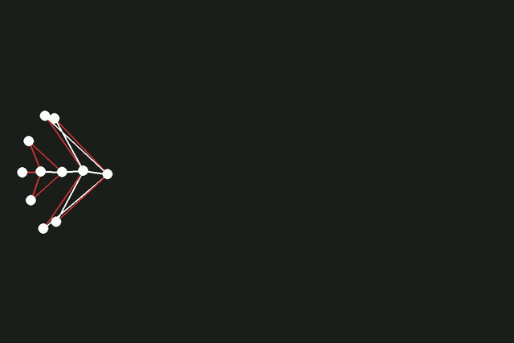

# 🧬 Massively Parallel Neuroevolution for Aquatic Soft-Body Locomotion



*Best swimming gait obtained so far (11 nodes, 16 links), 500 frames. This
controller predates the fixes described below: its archived score is not
reproducible and its performance is bimodal across initial conditions. The
reproducible reference champion is `champion_raffine/reference.pt`.*

## 🚀 Overview

This repository implements a custom, fully vectorized 2D physics engine built from scratch in PyTorch to simulate soft-body aquatic creatures.

Instead of relying on standard loops or pre-built engines, this project leverages `torch.func.vmap` to achieve **massively parallel neural network evaluations**. By vectorizing both the physics simulation and the Brain (Multi-Layer Perceptron), the engine evaluates 50 morphologies × 30 concurrent rollouts in a single batched pass.

## 📊 Current Status

The creatures swim. The reference champion (9 nodes, 12 links) travels a mean of
**577 units over 1000 frames** across 20 initial conditions, ranging from 156 to
791, and its training score is reproducible on replay to within 1%.

Remaining limitation: the reward telescopes to net displacement, so nothing yet
requires sustained motion — behaviour degrades beyond the 300-frame training
horizon. Next step is a reward on maintained velocity.

## 🔬 How we got there

Four compounding specification and implementation bugs had to be found first. Full
log in [EXPERIMENTS.md](EXPERIMENTS.md).

**Champion weights were saved after the optimiser step**, so every archived
champion was a post-update, degraded version of the policy that had earned the
score — a 34% reproduction gap.

**Selection used `argmax` over a single rollout**, rewarding a favourable initial
condition as much as a better policy. Replaced by one brain per morphology
trained on the mean gradient of 30 concurrent rollouts.

**Gradients through the stiff mass-spring simulator reached 1.3 × 10⁸** with a
60-frame BPTT window, so `clip_grad_norm_(1.0)` was normalising away all
magnitude information. Shortening the window to 10 frames brought the norm to
~870 and unblocked learning.

**Rest lengths were computed on the un-noised topology**, so every rollout started
out of equilibrium and spring relaxation supplied a free initial impulse — counted
by the reward, never charged by the energy penalty. Rest lengths are now
recomputed per rollout on the perturbed positions: every unit of displacement has
to come from a muscle command.

Before those fixes, a learning-rate sweep had already established that the
gradient direction was sound and the step size was the binding constraint:


*50 episodes, batch 2000. Larger steps rise faster and collapse earlier; the
lr = 0 control separates the gradient's contribution from exploration-noise
annealing.*


*Extending the two best settings to 150 episodes reverses the ranking — a sweep
truncated at 50 episodes would have picked the wrong one.*

## ⚙️ Core Architecture & Physics

The environment is designed to study Embodied AI and morphological evolution in fluid dynamics.

### 1. Vectorized Mass-Spring-Damper System

Creatures are dynamically generated as graphs of nodes (masses) and edges (muscles/bones). The physical interactions are resolved using matrix operations for high-throughput batch processing.

Because evolved morphologies differ in node and edge count, every creature is padded to a common size and masked, so a heterogeneous population fits in a single dense tensor. Those dimensions are **fixed for the whole run** (`max_noeuds_fixe`, `max_muscles_fixe`) rather than derived from the largest creature in the population: letting them float meant one creature growing shifted the blocks of the observation vector for every controller, so previously learned weights read the wrong inputs — the suspected cause of the abrupt performance drops observed at generations 14 and 23. Morphologies exceeding the fixed budget are rejected by an assertion at population assembly.

### 2. Hydrodynamic Drag Simulation

To force the neural networks to learn realistic swimming patterns rather than exploiting simulation glitches, a custom directional drag model is applied to every segment:

```
F_drag = -k_water * d * (v · n) * n
```

Where `d` is the segment length, `v` is the mean velocity of the connected nodes, and `n` is the normal vector of the segment.

A weaker tangential component (30% of the normal coefficient) is applied along the segment direction, and the drag coefficient is scaled per link type — bones drag at full strength while muscles are attenuated, approximating the difference between a rigid paddle and a compliant one.

### 3. Neural Control & Actuation

Each creature is controlled by a PyTorch Neural Network taking relative node coordinates, velocities, current muscle contraction and a rhythmic clock signal as inputs. The network outputs target muscle contractions, which set the resting length of the springs.

The control loop runs at a lower rate than the physics: the policy is queried **every 5 frames**, and each frame integrates **10 physics sub-steps** (`sub_step`). A new command therefore holds for 50 integration steps, which keeps the backpropagation graph tractable and forces the controller to produce sustained deformations rather than per-step corrections.

### 4. Optimisation Loop

Two nested processes run together:

- **Evolutionary search over morphology** — insertion of a mirrored node pair, deletion of a mirrored node pair (with index remapping and a BFS connectivity check), link retyping (bone ↔ muscle) and length perturbation, all constrained to preserve bilateral symmetry. Elitist selection keeps the top half of the population each generation; each survivor produces one mutated child.
- **Gradient-based controller learning** — rewards are backpropagated *through* the differentiable physics simulator. Training uses truncated BPTT (10-frame window), gradient-norm clipping (`max_norm = 10`), and automatic detection and recovery from numerical divergence (NaN check every 20 frames, episode discarded and graph freed).

The two phases optimise the **same objective**: displacement with a constant energy
penalty (`coef_energie = 10000`, `coef_hauteur = 0` throughout). An earlier version
switched the objective mid-run — a curriculum — which made scores incomparable
across generations for a measured effect of −1.2%; it was removed. Phase 2 differs
from phase 1 only in that the morphology is frozen, the batch is much larger, the
exploration noise is annealed (0.030 → 0.005) and the Adam optimiser is never
re-instantiated.

## 📁 Repository Structure

| File | Role |
|---|---|
| `megaVecto.py` | Vectorised physics engine: springs, damping, hydrodynamic drag, observations, reward |
| `individu.py` | Creature genome: topology and mutation operators (bilateral symmetry enforced) |
| `brain.py` | MLP controller (3 layers, tanh output) |
| `train.py` | Phase 1 — evolutionary topology search with controller learning |
| `train2.py` | Phase 2 — controller refinement on a frozen champion morphology |
| `visualize.py` | Renders a saved champion and exports an MP4 |
| `config.py` | Single `Config` dataclass + CLI parser shared by every script |
| `config.yaml` | Default values for every parameter — edit here rather than in the code |
| `logger.py` | Structured run logger: append-only JSONL + CSV with a growing schema |
| `evaluate_seeds.py` | Sweeps initial-condition seeds for a champion, ranks them by displacement |
| `verify_reproducibility.py` | Replays a champion under exact phase-1 training conditions to check its announced score |
| `EXPERIMENTS.md` | Experiment log: hypotheses, settings, outcomes — negative results kept |

## 🔧 Configuration

Every script reads its parameters from the same `Config` dataclass. Values are
resolved in increasing order of priority:

1. the dataclass defaults (`config.py`)
2. the YAML file passed with `--config` (`config.yaml` by default)
3. explicit command-line arguments

```bash
python train.py                          # defaults + config.yaml
python train.py --lr 0.0005              # override one value
python train.py --config exp42.yaml      # use a different config file
python train.py --help                   # options relevant to this script only
```

Each script exposes only the fields it actually uses, so `--help` stays readable.

## 🛠️ Getting Started

### Prerequisites

- Python 3.10+
- PyTorch with CUDA (a GPU is strongly recommended — CPU fallback works but is impractically slow)
- PyYAML (configuration), Pygame & OpenCV (visualization and video export only)

```bash
pip install -r requirements.txt
```

### Watch the reference champion

A trained controller is included, so nothing has to be retrained to see the
system work:

```bash
python visualize.py --chemin-champion champion_raffine/reference.pt --seed 19
```

### Running the Training

**Phase 1** — evolutionary search across 50 morphologies × 30 concurrent rollouts:

```bash
python train.py
```

Champions are written to `elite_mutant/` at the end of each generation, and run
logs to `runs/`.

**Phase 2** — refine a single champion's controller on a frozen morphology, with a larger batch and a long training run:

```bash
python train2.py --chemin-champion elite_mutant/champion_gen_17_score_231.4_family_1.pt
```

Refined checkpoints are written to `champion_raffine/`.

### Evaluation

Check that a champion's announced score is reproducible, and find the initial
conditions it handles best:

```bash
python verify_reproducibility.py --chemin-champion champion_raffine/reference.pt
python evaluate_seeds.py --chemin-champion champion_raffine/reference.pt --nb-seeds 20
```

`--chemin-champion` can be set once in `config.yaml` (`chemin_champion:`) instead
of being repeated on every command.

> **Note:** training checkpoints and exported videos are not tracked, with the
> single exception of `champion_raffine/reference.pt`. Run `train.py` to produce
> your own.